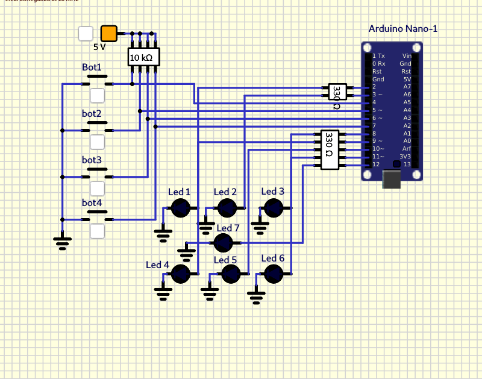

# TP2

## Dado electrónico. 

Utilizando un Arduino Nano (`atmega328p`), `6 ó 7 LEDs` y `3 Pulsadores` se pide:

1. Al presionar el `pulsador 1` se **encienden** los `LEDs` **barajando** las posibles respuestas
rápidamente.

2.  Al presionar el `pulsador 2` se **detiene** el cambio de los `LEDs`, **quedando encendidos**
aquellos que indican la "cara del dado que quedo hacia arriba". 

3. Una vez que se indica el `resultado`, se debe poder presionar el `pulsador 3 o 4` para
**apagar** los `LEDs` de manera de volver a la condición inicial.

> Nota: Todos los pulsadores `deben` tener habilitada la resistencia de `pull-up`

> Asi mismo los LEDs deben conectarse con su resistencia limitadora de corriente 2 asegurando no superar la corriente máxima que puede entregar el pin. Almenos de 330 Ohms.

## ¡USAR LOS PINES INDICADOS NO CAMBIARLOS!

``` C
PD4 -> BOTON 1 
PD5 -> BOTON 2 
PD6 -> BOTON 3 
PD7 -> BOTON 4

PD2 -> LED 1   
PD3 -> LED 2 
PB0 -> LED 3
PB1 -> LED 4 
PB2 -> LED 5 
PB3 -> LED 6
PB4 -> LED 7

```
## Pinout


## Circuito



# Informe

1. Empezamos el codigo definiendo cada `macro` por cada boton y otro `macro` general para los leds en este caso son <span style="color:red">7 LEDS</span> y <span style="color:cyan">4 BOTONES</span>

### Declaracion de botones (definicinión especifica) y leds (declaración general)
``` C
#define SET_PIN(PORT,PIN) (PORT|= 1<<PIN)
#define CLEAR_PIN(PORT,PIN) (PORT&=~(1<<PIN))

#define bot1 ((PIND>>4)&0X01)
#define bot2 ((PIND>>5)&0x01)
#define bot3 ((PIND>>6)&0X01)
#define bot4 ((PIND>>7)&0X01)
```

2. Cuando se terminan de crear los `macros` definimos el contador en el numero 1 para que el dado empiece a contar del <span style="color:orange">1 al 6</span> aparte del cont se debe definir el flag para el boton1 el cual debe estar en 0 


### Definición del contador (cont)
``` C
char cont =1;
char FLAG_BT1=0;
```

3. Ahora pasamos a definir `"mostrar_led"` para que encienda y apague los **<span style="color:red">LEDS</span>** en cada caso


### Función de "mostrar_led"
``` C
void mostrar_led(char num);
``` 

## Empezamos a trabajar dentro del **<span style="color:lightblue">Main</span>**

1. Arrancamos definiendo los `pines` como salidas ó como entradas dependiendo del caso, en este caso se tuvo que definir cada entrada y cada salida especificamente, ya que parte de los pines de los `botones` se usan para los **<span style="color:red">LEDS</span>** y también se definen cada resistencia `pull up` para cada boton 

### "Seteo" de puertos 

``` C
 DDRD &=~(1<<PD4); //Esta parte corresponde a los botones/entradas
 DDRD &=~(1<<PD5); 
 DDRD &=~(1<<PD6);
 DDRD &=~(1<<PD7);
 
 DDRD |=(1<<PD2); //Esta parte corresponde a los leds/salidas
 DDRD |=(1<<PD3);
 DDRB |=(1<<PB0);
 DDRB |=(1<<PB1);
 DDRB |=(1<<PB2);
 DDRB |=(1<<PB3);
 DDRB |=(1<<PB4);

 PORTD |=(1<<PD4); //Resistencias Pull up para los botones
 PORTD |=(1<<PD5);
 PORTD |=(1<<PD6);
 PORTD |=(1<<PD7);
 
``` 
2. Dentro del while vamos a hacer lo que nos pide arriba en la consigna, es decir vamos a preguntar si **<span style="color:pink">bot1</span>** está pulsado y si ese es el caso que el contador empiece a contar del <span style="color:orange">1 al 6</span> y los vaya mostrando con los **<span style="color:red">LEDS</span>**, para que estos no se quemen ponemos un <span style="color:lime">delay</span> por unos cuantos milisegundos.
``` C
   while(1)
  {
   if(bot1==0)
   {
     FLAG_BT1=1;
   }
  if (FLAG_BT1==1)
  {
      cont++;
    
     if (cont==7)
     {
       cont=1;
     }
     
     mostrar_led(cont);
     _delay_ms(100); 
  }
``` 
 3. Lo que sigue despues es preguntar si **<span style="color:pink">bot2</span>** esta acciónado y si es así va a detener el contador y mostrará el numero en el que quedó con los **<span style="color:red">LEDS</span>**

 ## "If" del botón 2 
 ``` C
 if (bot2 == 0)
  {
    FLAG_BT1=0;
  }
 ```
 4. Quedan los ultimos 2 botones **<span style="color:lightblue">bot3</span>** y **<span style="color:lightblue">bot4</span>** si están accionados directamente apagaran todos los leds reiniciando el dado electronico 
 ``` C
 if (bot3 == 0 || bot4 == 0)
  {
    CLEAR_PIN(PORTD,PD2);
    CLEAR_PIN(PORTD,PD3);
    CLEAR_PIN(PORTB,PB0);
    CLEAR_PIN(PORTB,PB1);
    CLEAR_PIN(PORTB,PB2);
    CLEAR_PIN(PORTB,PB3);
    CLEAR_PIN(PORTB,PB4);
  }
 ```

5. Ya que hemos terminado con la sección del <span style="color:red">WHILE</span> y los <span style="color:darkorange">IFs</span> lo que sigue es apagar los leds para poder volver a utilizar el dado electronico <span style="color:gray">switch</span> una vez dentro de "**<span style="color:gray">switch</span>**" vamos a definir cada caso desde el case/caso 1 al 6 

### Switch y los casos del dado con el previo apagado de los leds

``` C
void mostrar_led(char num)
{
  CLEAR_PIN(PORTD,PD2);
  CLEAR_PIN(PORTD,PD3);
  CLEAR_PIN(PORTB,PB0);
  CLEAR_PIN(PORTB,PB1);
  CLEAR_PIN(PORTB,PB2);
  CLEAR_PIN(PORTB,PB3);
  CLEAR_PIN(PORTB,PB4);

  switch (num)
  {
    
    case 1:
    SET_PIN(PORTB,PB4);
    break;
    
    case 2:
    SET_PIN(PORTB,PB0);
    SET_PIN(PORTB,PB1);
    break;
    
    case 3:
    SET_PIN(PORTB,PB4);
    SET_PIN(PORTB,PB0);
    SET_PIN(PORTB,PB1);
    break;
    
    case 4:
    SET_PIN(PORTD,PD2);
    SET_PIN(PORTB,PB0);
    SET_PIN(PORTB,PB1);
    SET_PIN(PORTB,PB3);
     break;
    case 5:
    SET_PIN(PORTD,PD2);
    SET_PIN(PORTB,PB0);
    SET_PIN(PORTB,PB1);
    SET_PIN(PORTB,PB3);
    SET_PIN(PORTB,PB4);
    break;
    
    case 6:
    SET_PIN(PORTD,PD2);
    SET_PIN(PORTD,PD3);
    SET_PIN(PORTB,PB0);
    SET_PIN(PORTB,PB1);
    SET_PIN(PORTB,PB3);
    break;                
  }
}
``` 
# Diagrama de Flujo Pt1

# Diagrama de Flujo Pt2
